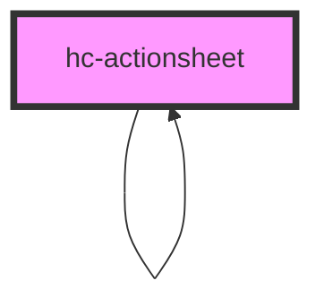

# hc-actionsheet

<!-- Auto Generated Below -->

## Properties

| Property  | Attribute | Description | Type     | Default     |
| --------- | --------- | ----------- | -------- | ----------- |
| `buttons` | `buttons` |             | `string` | ``['取消']``  |
| `content` | `content` |             | `string` | `undefined` |
| `current` | `current` |             | `string` | `undefined` |
| `titles`  | `titles`  |             | `string` | `undefined` |

## Events

| Event     | Description | Type               |
| --------- | ----------- | ------------------ |
| `vchange` |             | `CustomEvent<any>` |
| `vclick`  |             | `CustomEvent<any>` |

## Methods

### `init(option: any) => Promise<HTMLHcActionsheetElement>`

#### Returns

Type: `Promise<HTMLHcActionsheetElement>`

## Dependencies

### Used by

 - [hc-actionsheet]()

### Depends on

- [hc-icon](../icon)
- [hc-actionsheet]()
- [hc-drawer](../drawer)

### Graph

----------------------------------------------

*Built with swimly!*
