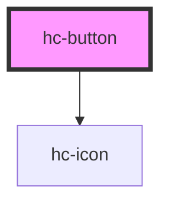

# hc-button
### 普通按钮
<hc-button>按钮</hc-button>
<hc-button type="primary">按钮</hc-button>
<hc-button type="danger">按钮</hc-button>

``` html
<hc-button>按钮</hc-button>
<hc-button type="primary">按钮</hc-button>
<hc-button type="danger">按钮</hc-button>
```
### 不同弧度
<hc-button shape="conner">按钮</hc-button>
<hc-button shape="rounder">按钮</hc-button>
<script type="module" src="../../www/build/mui.esm.js"></script>
<style>
  hc-button{
    margin:10px 0;
  }
</style>
<!-- Auto Generated Below -->


## Properties

| Property   | Attribute  | Description | Type                                 | Default     |
| ---------- | ---------- | ----------- | ------------------------------------ | ----------- |
| `color`    | `color`    | 自定义按钮颜色     | `string`                             | `''`        |
| `disabled` | `disabled` |             | `boolean`                            | `false`     |
| `icon`     | `icon`     | 按钮类型        | `string`                             | `undefined` |
| `shape`    | `shape`    | 按钮形状        | `"conner" \| "default" \| "rounder"` | `'default'` |
| `type`     | `type`     | 按钮类型        | `"danger" \| "default" \| "primary"` | `'default'` |


## Events

| Event    | Description | Type               |
| -------- | ----------- | ------------------ |
| `vclick` |             | `CustomEvent<any>` |


## Methods

### `finishloading() => Promise<void>`


#### Returns

Type: `Promise<void>`


### `loading() => Promise<void>`


#### Returns

Type: `Promise<void>`


## Dependencies

### Depends on

- [hc-icon](../icon)

### Graph


----------------------------------------------

*Built with swimly!*
