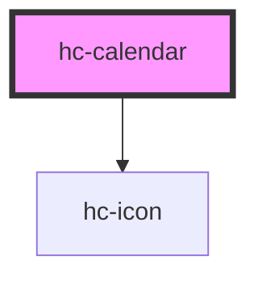

# hc-calendar

<!-- Auto Generated Below -->

## Properties

| Property    | Attribute   | Description | Type      | Default                       |
| ----------- | ----------- | ----------- | --------- | ----------------------------- |
| `choice`    | `choice`    |             | `number`  | `0`                           |
| `day`       | `day`       |             | `number`  | `(new Date()).getDate()`      |
| `end`       | `end`       |             | `string`  | `undefined`                   |
| `gesture`   | `gesture`   |             | `boolean` | `false`                       |
| `lunar`     | `lunar`     |             | `boolean` | `false`                       |
| `month`     | `month`     |             | `number`  | `(new Date()).getMonth() + 1` |
| `start`     | `start`     |             | `string`  | `undefined`                   |
| `type`      | `type`      |             | `string`  | `'month'`                     |
| `vshape`    | `vshape`    |             | `boolean` | `false`                       |
| `watermark` | `watermark` |             | `boolean` | `true`                        |
| `week`      | `week`      |             | `number`  | `undefined`                   |
| `weekday`   | `weekday`   |             | `number`  | `undefined`                   |
| `year`      | `year`      |             | `number`  | `(new Date()).getFullYear()`  |

## Dependencies

### Depends on

- [hc-icon](../icon)

### Graph

----------------------------------------------

*Built with swimly!*
