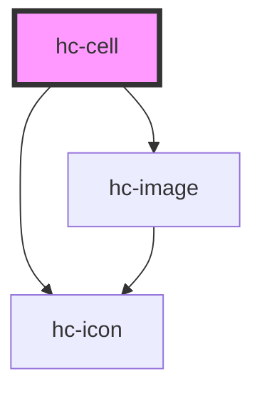

# hc-cell

<!-- Auto Generated Below -->

## Properties

| Property         | Attribute         | Description | Type      | Default     |
| ---------------- | ----------------- | ----------- | --------- | ----------- |
| `arrowDirection` | `arrow-direction` |             | `string`  | `undefined` |
| `iconSize`       | `icon-size`       |             | `number`  | `42`        |
| `iconUrl`        | `icon-url`        |             | `string`  | `undefined` |
| `label`          | `label`           |             | `string`  | `undefined` |
| `middle`         | `middle`          |             | `boolean` | `false`     |
| `subject`        | `subject`         |             | `string`  | `undefined` |
| `value`          | `value`           |             | `string`  | `undefined` |

## Dependencies

### Depends on

- [hc-image](../image)
- [hc-icon](../icon)

### Graph

----------------------------------------------

*Built with swimly!*
