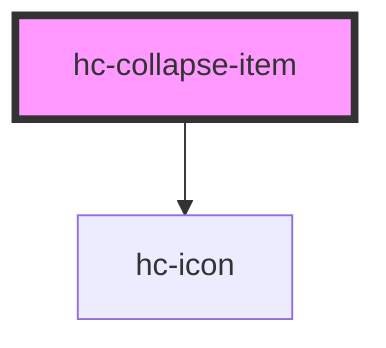

# hc-collapse-item

<!-- Auto Generated Below -->

## Properties

| Property | Attribute | Description | Type      | Default         |
| -------- | --------- | ----------- | --------- | --------------- |
| `arrow`  | `arrow`   |             | `string`  | `'arrow-right'` |
| `name`   | `name`    |             | `string`  | `undefined`     |
| `open`   | `open`    |             | `boolean` | `false`         |
| `titles` | `titles`  |             | `string`  | `undefined`     |

## Events

| Event     | Description | Type               |
| --------- | ----------- | ------------------ |
| `vchange` |             | `CustomEvent<any>` |

## Dependencies

### Depends on

- [hc-icon](../icon)

### Graph

----------------------------------------------

*Built with swimly!*
