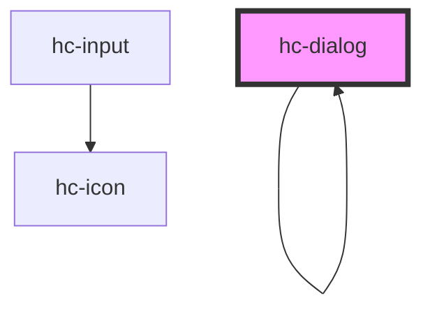

# hc-dialog

<button>zoom</button>
<hc-dialog id="dialog" titles="提示" content="已经很晚了，要早点睡觉哦！"></hc-dialog>

``` html
<button id="d">弹窗</button>
<hc-dialog effect="zoomdown" titles="友情提示！" content="夜已深了，快睡觉吧！" footer="['取消', '确定']"></hc-dialog>
<script>
  document.querySelector('#d').addEventListener('click', e => {
    var dialog = document.querySelector('hc-dialog')
    dialog.visible = true
    dialog.addEventListener('onHide', data => {
      console.log(data)
    })
  })
</script>
```

``` html
<button class="button">zoom</button>
<button class="button">zoomup</button>
<button class="button">zoomdown</button>
<button class="button">slidedown</button>
<script type="module">
  import {hc_dialog} from '/build/hc-dialog.entry.js'
  const dialog = new hc_dialog({})
  window.dialog = dialog
</script>
<script>
  var buttons = document.querySelectorAll('.button')
  buttons.forEach(button => {
    button.addEventListener('click', e => {
      var effect = button.innerText
      var t = dialog.init({
        titles: '提示！',
        content: '恭喜您，成功注册为本站会员',
        effect: effect
      })
      t.then(res => {
        res.addEventListener('onHide', data => {
          console.log(data)
        })
      })
    })
  })
</script>
```

<script type="module" src="../../www/build/mui.esm.js"></script>
<script>
  alert(0)
</script>

<!-- Auto Generated Below -->


## Properties

| Property      | Attribute     | Description | Type                 | Default     |
| ------------- | ------------- | ----------- | -------------------- | ----------- |
| `content`     | `content`     | 内容          | `string`             | `undefined` |
| `duration`    | `duration`    | 定时关闭        | `number`             | `undefined` |
| `effect`      | `effect`      | 样式          | `"fadeIn" \| "zoom"` | `'zoom'`    |
| `footer`      | `footer`      | 底部按钮        | `string`             | `"['知道了']"` |
| `placeholder` | `placeholder` |             | `string`             | `undefined` |
| `titles`      | `titles`      | 标题          | `string`             | `undefined` |
| `type`        | `type`        | 类型          | `string`             | `undefined` |
| `visible`     | `visible`     | 显示隐藏        | `boolean`            | `false`     |


## Events

| Event      | Description | Type               |
| ---------- | ----------- | ------------------ |
| `vdestory` |             | `CustomEvent<any>` |


## Methods

### `destory(item: any) => Promise<void>`


#### Returns

Type: `Promise<void>`


### `display() => Promise<void>`


#### Returns

Type: `Promise<void>`


### `init(option: any) => Promise<HTMLHcDialogElement>`

已服务的形式调用

#### Returns

Type: `Promise<HTMLHcDialogElement>`


## Dependencies

### Used by

 - [hc-dialog]()

### Depends on

- [hc-input](../input)
- [hc-dialog]()

### Graph


----------------------------------------------

*Built with swimly!*
