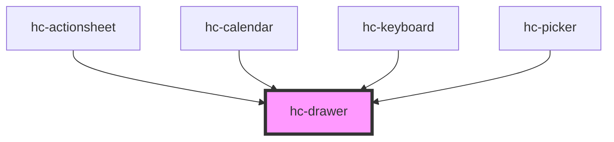

# hc-drawer

<!-- Auto Generated Below -->

## Properties

| Property       | Attribute       | Description | Type      | Default     |
| -------------- | --------------- | ----------- | --------- | ----------- |
| `direction`    | `direction`     |             | `string`  | `'btt'`     |
| `mask`         | `mask`          |             | `boolean` | `true`      |
| `maskClosable` | `mask-closable` |             | `boolean` | `true`      |
| `padding`      | `padding`       |             | `number`  | `undefined` |
| `round`        | `round`         |             | `boolean` | `false`     |
| `transparent`  | `transparent`   |             | `boolean` | `false`     |
| `visible`      | `visible`       |             | `boolean` | `false`     |

## Methods

### `destory() => Promise<void>`

#### Returns

Type: `Promise<void>`

### `init() => Promise<void>`

#### Returns

Type: `Promise<void>`

## Dependencies

### Used by

 - [hc-actionsheet](../actionsheet)
 - [hc-calendar](../calendar)
 - [hc-keyboard](../keyboard)
 - [hc-picker](../picker)

### Graph

----------------------------------------------

*Built with swimly!*
