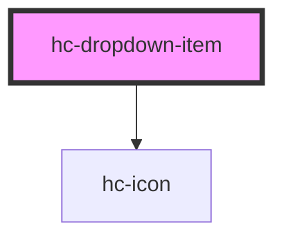

# hc-dropdown-item

<!-- Auto Generated Below -->

## Properties

| Property | Attribute | Description | Type     | Default     |
| -------- | --------- | ----------- | -------- | ----------- |
| `label`  | `label`   |             | `string` | `undefined` |
| `option` | `option`  |             | `any`    | `undefined` |
| `value`  | `value`   |             | `any`    | `undefined` |

## Dependencies

### Depends on

- [hc-icon](../icon)

### Graph

----------------------------------------------

*Built with swimly!*
