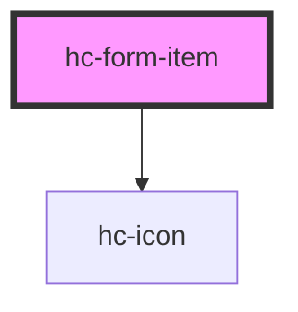

# hc-form-item

<!-- Auto Generated Below -->

## Properties

| Property        | Attribute        | Description | Type     | Default     |
| --------------- | ---------------- | ----------- | -------- | ----------- |
| `label`         | `label`          |             | `string` | `undefined` |
| `labelPosition` | `label-position` |             | `string` | `undefined` |
| `labelWidth`    | `label-width`    |             | `string` | `undefined` |
| `prefixColor`   | `prefix-color`   |             | `string` | `undefined` |
| `prefixIcon`    | `prefix-icon`    |             | `string` | `undefined` |
| `prefixSize`    | `prefix-size`    |             | `number` | `28`        |
| `suffixColor`   | `suffix-color`   |             | `string` | `undefined` |
| `suffixIcon`    | `suffix-icon`    |             | `string` | `undefined` |
| `suffixSize`    | `suffix-size`    |             | `number` | `28`        |
| `tip`           | `tip`            |             | `string` | `undefined` |
| `value`         | `value`          |             | `string` | `undefined` |

## Dependencies

### Depends on

- [hc-icon](../icon)

### Graph

----------------------------------------------

*Built with swimly!*
