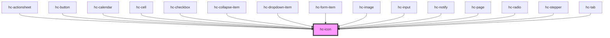

# hc-icon
<hc-icon></hc-icon>

<!-- Auto Generated Below -->

## Properties

| Property | Attribute | Description | Type      | Default     |
| -------- | --------- | ----------- | --------- | ----------- |
| `color`  | `color`   |             | `string`  | `undefined` |
| `name`   | `name`    |             | `string`  | `undefined` |
| `size`   | `size`    |             | `number`  | `undefined` |
| `spin`   | `spin`    |             | `boolean` | `false`     |

## Dependencies

### Used by

 - [hc-actionsheet](../actionsheet)
 - [hc-button](../button)
 - [hc-calendar](../calendar)
 - [hc-cell](../cell)
 - [hc-checkbox](../checkbox)
 - [hc-collapse-item](../collapse-item)
 - [hc-dropdown-item](../dropdown-item)
 - [hc-form-item](../form-item)
 - [hc-image](../image)
 - [hc-input](../input)
 - [hc-notify](../notify)
 - [hc-page](../page)
 - [hc-radio](../radio)
 - [hc-stepper](../stepper)
 - [hc-tab](../tab)

### Graph

----------------------------------------------

*Built with swimly!*
