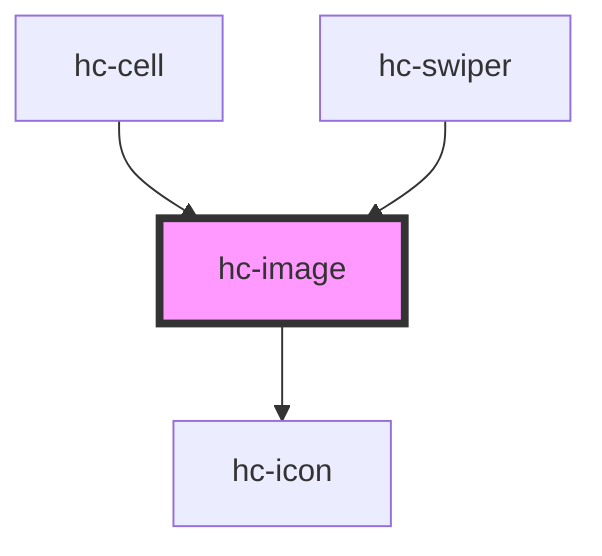

# hc-image

<!-- Auto Generated Below -->

## Properties

| Property | Attribute | Description | Type               | Default     |
| -------- | --------- | ----------- | ------------------ | ----------- |
| `fit`    | `fit`     |             | `string`           | `'cover'`   |
| `height` | `height`  |             | `number \| string` | `200`       |
| `lazy`   | `lazy`    |             | `boolean`          | `false`     |
| `src`    | `src`     |             | `string`           | `undefined` |
| `status` | `status`  |             | `number`           | `0`         |
| `width`  | `width`   |             | `number \| string` | `200`       |

## Dependencies

### Used by

 - [hc-cell](../cell)
 - [hc-swiper](../swiper)

### Depends on

- [hc-icon](../icon)

### Graph

----------------------------------------------

*Built with swimly!*
