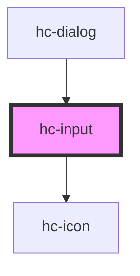

# hc-input

<!-- Auto Generated Below -->

## Properties

| Property      | Attribute      | Description | Type      | Default     |
| ------------- | -------------- | ----------- | --------- | ----------- |
| `align`       | `align`        |             | `string`  | `undefined` |
| `clearable`   | `clearable`    |             | `boolean` | `false`     |
| `error`       | `error`        |             | `string`  | `undefined` |
| `maxlength`   | `maxlength`    |             | `number`  | `undefined` |
| `minlength`   | `minlength`    |             | `number`  | `undefined` |
| `placeholder` | `placeholder`  |             | `string`  | `'请输入'`     |
| `prefixColor` | `prefix-color` |             | `string`  | `undefined` |
| `prefixIcon`  | `prefix-icon`  |             | `string`  | `undefined` |
| `suffixColor` | `suffix-color` |             | `string`  | `undefined` |
| `suffixIcon`  | `suffix-icon`  |             | `string`  | `undefined` |
| `type`        | `type`         |             | `string`  | `'text'`    |
| `value`       | `value`        |             | `string`  | `undefined` |
| `warning`     | `warning`      |             | `string`  | `undefined` |

## Dependencies

### Used by

 - [hc-dialog](../dialog)

### Depends on

- [hc-icon](../icon)

### Graph

----------------------------------------------

*Built with swimly!*
