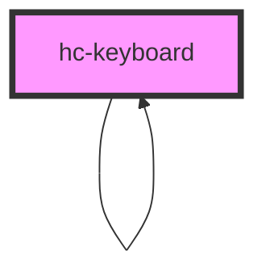

# hc-keyboard

<!-- Auto Generated Below -->

## Properties

| Property  | Attribute | Description | Type      | Default      |
| --------- | --------- | ----------- | --------- | ------------ |
| `tooltip` | `tooltip` |             | `boolean` | `undefined`  |
| `type`    | `type`    |             | `string`  | `'password'` |
| `value`   | `value`   |             | `string`  | `''`         |
| `vibrate` | `vibrate` |             | `number`  | `0`          |

## Events

| Event     | Description | Type               |
| --------- | ----------- | ------------------ |
| `vchange` |             | `CustomEvent<any>` |
| `vfinish` |             | `CustomEvent<any>` |
| `vhide`   |             | `CustomEvent<any>` |

## Methods

### `init(option: any) => Promise<HTMLHcKeyboardElement>`

#### Returns

Type: `Promise<HTMLHcKeyboardElement>`

## Dependencies

### Used by

 - [hc-keyboard]()

### Depends on

- [hc-keyboard]()
- [hc-drawer](../drawer)

### Graph

----------------------------------------------

*Built with swimly!*
