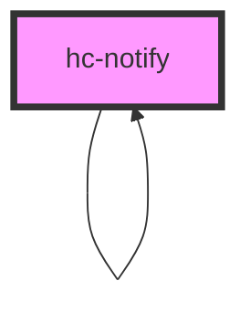

# hc-notify

<!-- Auto Generated Below -->

## Properties

| Property     | Attribute    | Description | Type      | Default             |
| ------------ | ------------ | ----------- | --------- | ------------------- |
| `background` | `background` |             | `string`  | `'rgba(0,0,0,0.8)'` |
| `duration`   | `duration`   |             | `number`  | `3000`              |
| `icon`       | `icon`       |             | `string`  | `undefined`         |
| `iconsize`   | `iconsize`   |             | `number`  | `36`                |
| `position`   | `position`   |             | `string`  | `'center'`          |
| `spin`       | `spin`       |             | `boolean` | `false`             |
| `text`       | `text`       |             | `string`  | `'提交成功！'`           |
| `type`       | `type`       |             | `string`  | `undefined`         |
| `visible`    | `visible`    |             | `boolean` | `false`             |

## Methods

### `destoryNotify() => Promise<void>`

(optional) 销毁notify

#### Returns

Type: `Promise<void>`

### `init(option: any) => Promise<HTMLHcNotifyElement>`

已服务的形式调用

#### Returns

Type: `Promise<HTMLHcNotifyElement>`

### `showNotify() => Promise<void>`

(optional) 初始化notify

#### Returns

Type: `Promise<void>`

## Dependencies

### Used by

 - [hc-notify]()

### Depends on

- [hc-icon](../icon)
- [hc-notify]()

### Graph

----------------------------------------------

*Built with swimly!*
