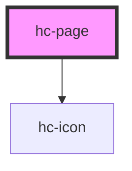

# hc-page

<!-- Auto Generated Below -->

## Properties

| Property         | Attribute         | Description | Type      | Default                                             |
| ---------------- | ----------------- | ----------- | --------- | --------------------------------------------------- |
| `background`     | `background`      |             | `string`  | `'#f5f5f5'`                                         |
| `color`          | `color`           |             | `string`  | `'#262626'`                                         |
| `headBackground` | `head-background` |             | `string`  | `'#fff'`                                            |
| `hideHeader`     | `hide-header`     |             | `boolean` | `false`                                             |
| `leftButtons`    | `left-buttons`    |             | `string`  | `'[{icon: "arrow-lift", label: "返回", id: "back"}]'` |
| `padding`        | `padding`         |             | `string`  | `'0'`                                               |
| `rightButtons`   | `right-buttons`   |             | `string`  | `'[]'`                                              |
| `scrolldistance` | `scrolldistance`  |             | `number`  | `0`                                                 |
| `titles`         | `titles`          |             | `string`  | `undefined`                                         |

## Events

| Event     | Description | Type               |
| --------- | ----------- | ------------------ |
| `vclick`  |             | `CustomEvent<any>` |
| `vscroll` |             | `CustomEvent<any>` |

## Methods

### `scrollGo(pos: number) => Promise<void>`

#### Returns

Type: `Promise<void>`

## Dependencies

### Depends on

- [hc-icon](../icon)

### Graph

----------------------------------------------

*Built with swimly!*
