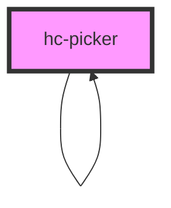

# hc-picker

<!-- Auto Generated Below -->

## Properties

| Property       | Attribute       | Description | Type     | Default     |
| -------------- | --------------- | ----------- | -------- | ----------- |
| `cancelLabel`  | `cancel-label`  |             | `string` | `'取消'`      |
| `confirmLabel` | `confirm-label` |             | `string` | `'确定'`      |
| `data`         | `data`          |             | `any`    | `undefined` |
| `itemHeight`   | `item-height`   |             | `number` | `44`        |
| `separate`     | `separate`      |             | `string` | `','`       |
| `value`        | `value`         |             | `string` | `undefined` |
| `vis`          | `vis`           |             | `number` | `5`         |

## Events

| Event     | Description | Type               |
| --------- | ----------- | ------------------ |
| `vchange` |             | `CustomEvent<any>` |
| `vclick`  |             | `CustomEvent<any>` |

## Methods

### `init(option: any) => Promise<HTMLHcPickerElement>`

#### Returns

Type: `Promise<HTMLHcPickerElement>`

## Dependencies

### Used by

 - [hc-picker]()

### Depends on

- [hc-picker]()
- [hc-drawer](../drawer)

### Graph

----------------------------------------------

*Built with swimly!*
