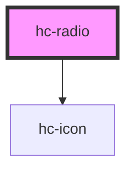

# hc-radio

<!-- Auto Generated Below -->

## Properties

| Property  | Attribute | Description | Type      | Default     |
| --------- | --------- | ----------- | --------- | ----------- |
| `checked` | `checked` |             | `boolean` | `false`     |
| `color`   | `color`   |             | `string`  | `undefined` |
| `icon`    | `icon`    |             | `string`  | `'seleted'` |
| `name`    | `name`    |             | `string`  | `undefined` |
| `shape`   | `shape`   |             | `string`  | `undefined` |
| `type`    | `type`    |             | `string`  | `undefined` |
| `value`   | `value`   |             | `any`     | `undefined` |

## Events

| Event     | Description | Type               |
| --------- | ----------- | ------------------ |
| `vchange` |             | `CustomEvent<any>` |

## Dependencies

### Depends on

- [hc-icon](../icon)

### Graph

----------------------------------------------

*Built with swimly!*
