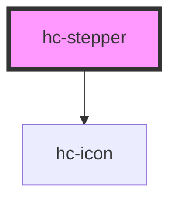

# hc-stepper

<!-- Auto Generated Below -->

## Properties

| Property | Attribute | Description | Type     | Default |
| -------- | --------- | ----------- | -------- | ------- |
| `max`    | `max`     |             | `number` | `10`    |
| `min`    | `min`     |             | `number` | `0`     |
| `step`   | `step`    |             | `number` | `1`     |
| `value`  | `value`   |             | `number` | `0`     |

## Dependencies

### Depends on

- [hc-icon](../icon)

### Graph

----------------------------------------------

*Built with swimly!*
