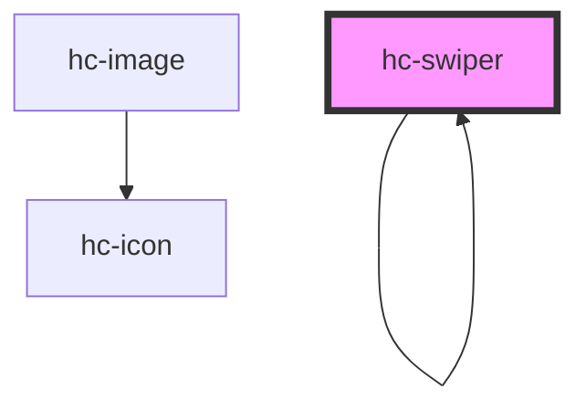

# hc-swiper

<!-- Auto Generated Below -->

## Properties

| Property    | Attribute   | Description | Type      | Default        |
| ----------- | ----------- | ----------- | --------- | -------------- |
| `autoplay`  | `autoplay`  |             | `boolean` | `false`        |
| `current`   | `current`   |             | `number`  | `0`            |
| `direction` | `direction` |             | `string`  | `'horizontal'` |
| `duration`  | `duration`  |             | `number`  | `3000`         |
| `fit`       | `fit`       |             | `string`  | `'cover'`      |
| `height`    | `height`    |             | `number`  | `200`          |
| `loop`      | `loop`      |             | `boolean` | `false`        |
| `width`     | `width`     |             | `number`  | `undefined`    |

## Events

| Event     | Description | Type               |
| --------- | ----------- | ------------------ |
| `vchange` |             | `CustomEvent<any>` |

## Methods

### `init(option: any) => Promise<HTMLHcSwiperElement>`

已服务的形式调用

#### Returns

Type: `Promise<HTMLHcSwiperElement>`

## Dependencies

### Used by

 - [hc-swiper]()

### Depends on

- [hc-swiper]()
- [hc-image](../image)

### Graph

----------------------------------------------

*Built with swimly!*
