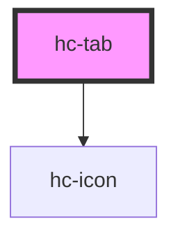

# hc-tab

<!-- Auto Generated Below -->

## Properties

| Property        | Attribute        | Description | Type      | Default        |
| --------------- | ---------------- | ----------- | --------- | -------------- |
| `align`         | `align`          |             | `string`  | `'flex-start'` |
| `current`       | `current`        |             | `number`  | `0`            |
| `data`          | `data`           |             | `string`  | `undefined`    |
| `indicateWidth` | `indicate-width` |             | `number`  | `10`           |
| `show`          | `show`           |             | `boolean` | `false`        |
| `showMore`      | `show-more`      |             | `boolean` | `false`        |

## Dependencies

### Depends on

- [hc-icon](../icon)

### Graph

----------------------------------------------

*Built with swimly!*
